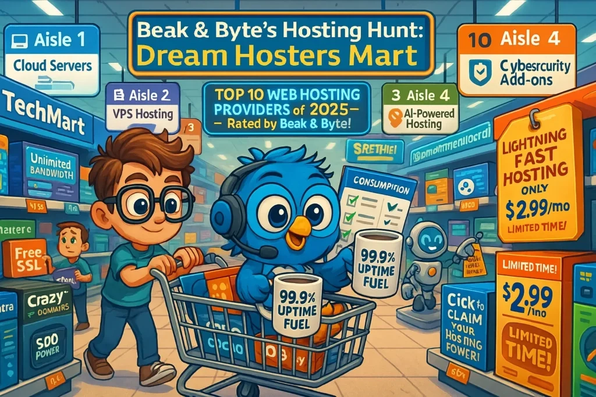

# Top 10 Web Hosting Providers of 2025 (Ranked & Reviewed)

---

Looking for the best web hosting providers in 2025? Whether you're launching your first blog, deploying cloud apps, or scaling an enterprise site, choosing the right host matters more than ever. Speed, uptime, support, and pricing can make or break your online presence. This guide breaks down the top 10 web hosting providers of 2025—from budget-friendly powerhouses to developer-focused cloud solutions—so you can find your perfect match without the usual marketing fluff.

---

## 🚀 Hosting.com (formerly A2 Hosting) – Speed Demons Welcome

Need your site to load faster than your competitors? Hosting.com delivers turbocharged performance that won't leave visitors staring at loading screens.

**Plan Highlights:**
- **Pricing:** $2.99/month (renews at $11.99/month)
- **Best For:** Developers, startups, eCommerce sites

**Why It Works:**
Turbo servers push your site into the fast lane with enhanced security, free migrations, and global data centers. Developer tools like SSH, Git, and WP-CLI come standard. The catch? Premium features live in higher-tier plans, and the dashboard might overwhelm newbies.

**The Reality:**
If site speed directly impacts your revenue or user experience, the renewal price is worth it. This is performance-first hosting.

👉 [**Want blazing-fast load times that actually convert visitors?**](https://cp.gthost.com/en/join/72c7e6b2fc118929f9ede2978f008806)

## 💸 Crazy Domains – Budget-Friendly Without the Compromise

Tight budget doesn't mean settling for unreliable hosting. Crazy Domains proves you can get solid uptime and support without breaking the bank.

**Plan Highlights:**
- **Pricing:** $3.25/month (renews at $10.50/month)
- **Best For:** Beginners, small business owners

**Why It Works:**
Quick setup, free SSL on select plans, easy cPanel access, and 24/7 India-based support. Global CDN available. The trade-off? Limited bandwidth on entry plans and renewal price increases.

**The Reality:**
Perfect for first-timers who need reliable hosting without the learning curve or premium price tag.

## 🧠 RoseHosting – When You Need Real Linux Expertise

Running Linux-based applications? RoseHosting delivers managed VPS with actual humans who know Linux inside out—not just a ticket system.

**Plan Highlights:**
- **Pricing:** $14.95/month (no renewal tricks)
- **Best For:** Developers, Linux geeks, agencies

**Why It Works:**
NVMe SSD storage, root access, expert-managed hosting, free SSL, daily backups, and 24/7 real tech support. Not the cheapest, but you're paying for expertise.

**The Reality:**
This is professional-grade hosting. If you need VPS power with hands-on support, RoseHosting earns its premium.

## 🌐 GTHost – Deploy Now, Pay by the Hour

Need servers instantly without long-term commitments? GTHost delivers with hourly billing and global reach.

**Plan Highlights:**
- **Pricing:** $5/day with hourly billing
- **Best For:** Testing environments, dev projects, fast launches

**Why It Works:**
Instant server setup across 17+ global data centers, hourly billing saves costs, root access included, SSD-only storage. Interface isn't beginner-friendly, and there's no shared hosting option.

**The Reality:**
For developers and testers who need flexibility without waste, this billing model is genius.

👉 [**Need instant deployment with zero long-term commitment?**](https://cp.gthost.com/en/join/72c7e6b2fc118929f9ede2978f008806)

## ⚡ AccuWeb Hosting – Built for Heavy Traffic

High traffic demands zero downtime. AccuWeb Hosting delivers enterprise-grade performance without enterprise-level complexity.

**Plan Highlights:**
- **Pricing:** $4.99/month (renews at $9.99/month)
- **Best For:** Developers, enterprises, high-traffic websites

**Why It Works:**
Fast SSD storage, free SSL and migration, global data centers with 99.9% uptime, 24/7 live chat, custom server configurations. Higher entry costs and variable support response times.

**The Reality:**
When uptime and power matter more than initial price, AccuWeb delivers consistently.

## 🏷️ InterServer – Price Lock Guarantee Changes Everything

Tired of renewal price shocks? InterServer's price lock means what you pay today, you pay forever.

**Plan Highlights:**
- **Pricing:** $2.50/month (locked forever)
- **Best For:** Budget-conscious developers, long-term projects

**Why It Works:**
Price lock guarantee, free migration and weekly backups, developer tools, 24/7 US-based support. Limited data center locations and dated UI.

**The Reality:**
For long-term projects, price predictability beats flashy features every time.

## 🏗️ Contabo – Massive Specs, Minimal Cost

Want dedicated server specs on a VPS budget? Contabo delivers generous resources at prices that seem too good to be true.

**Plan Highlights:**
- **Pricing:** Starts at $6.99/month
- **Best For:** Developers, agencies, power users

**Why It Works:**
Tons of storage and RAM for the price, global data centers, root access, flexible upgrades, free DDoS protection. Longer setup times and less modern UI.

**The Reality:**
You get what you manage yourself. Great value if you don't need hand-holding.

## ☁️ DigitalOcean – Cloud Without the AWS Headache

Want serious cloud power without AWS complexity? DigitalOcean simplifies infrastructure for developers who want to build, not configure endlessly.

**Plan Highlights:**
- **Pricing:** Starts at $4/month
- **Best For:** Developers, startups, SaaS builders

**Why It Works:**
Lightning-fast SSDs, developer-friendly APIs, vertical scalability, global data centers, robust documentation. Not beginner-friendly with limited live support.

**The Reality:**
This is a developer playground. If you know your way around cloud infrastructure, DigitalOcean removes friction.

## ⚡ Kamatera – Total Cloud Customization

Want your cloud server configured exactly your way? Kamatera gives you full control over every spec.

**Plan Highlights:**
- **Pricing:** Starts at $4/month (fully customizable)
- **Best For:** Cloud pros, SaaS developers, enterprises

**Why It Works:**
Fully customizable server configurations, global data centers, instant scalability, private network and security layers, 24/7 cloud engineers. Too complex for beginners with a potentially confusing pricing calculator.

**The Reality:**
Build your infrastructure like ordering a custom pizza. For serious cloud users only.

## 🐆 JaguarPC – Legacy Reliability Still Delivers

Operating since 1998, JaguarPC proves old-school reliability can coexist with modern features.

**Plan Highlights:**
- **Pricing:** Starts at $3.96/month (renews around $10/month)
- **Best For:** Bloggers, freelancers, loyal customers

**Why It Works:**
Managed WordPress hosting, unlimited email accounts, free SSL and malware scanning, 24/7 expert support, SSD storage on all plans. Slightly dated UI with renewal price jumps.

**The Reality:**
Sometimes experience matters. JaguarPC's longevity speaks to consistent reliability.

---

## 🏁 Choose Your Perfect Hosting Partner

Here's your quick-pick guide:

- **Budget-friendly reliability?** InterServer or Contabo
- **Cloud-level control?** Kamatera and DigitalOcean  
- **Speed obsessed?** Hosting.com rockets your site ahead
- **Legacy trust?** JaguarPC's decades of experience
- **Premium support?** RoseHosting delivers expertise
- **Global presence with deals?** Crazy Domains checks boxes
- **Instant deployment?** GTHost launches in 5-15 minutes

Choose your host. Launch your site. Own the web in 2025.

---

## Conclusion

The best web hosting provider in 2025 depends on what matters most to you—speed, price, support, or flexibility. From budget warriors like InterServer to cloud kings like Kamatera, this list covers every use case. The key? Match your needs with the right provider's strengths. Don't just chase the cheapest price or the flashiest features. Think about where your site will be in six months, then pick the host that grows with you. 

👉 [**Ready to launch with hosting that actually matches your ambitions?**](https://cp.gthost.com/en/join/72c7e6b2fc118929f9ede2978f008806)

---

## 🤔 FAQs: Choosing the Right Web Hosting Provider in 2025

**What's the fastest web hosting for 2025?**
Hosting.com (formerly A2 Hosting) leads with turbo servers optimized for maximum speed—perfect for sites where load time impacts conversions.

**Which hosting provider offers the most affordable plans?**
InterServer stands out with price-lock guarantees and month-to-month flexibility, ideal for startups watching every dollar.

**What's the best hosting for WordPress?**
RoseHosting delivers managed WordPress hosting with expert support, free SSL, and optimized performance.

**Which service provides the best cloud solutions?**
Kamatera offers fully customizable cloud configurations with instant scalability and dedicated cloud engineers available 24/7.

**What hosting works best for developers?**
DigitalOcean provides scalable cloud solutions with developer-friendly APIs and comprehensive documentation—built for web apps and SaaS projects.

**Which provider offers the most storage for the price?**
Contabo delivers massive storage and high-performance VPS hosting at surprisingly affordable rates.

**What's the top choice for managed hosting?**
AccuWeb Hosting provides expert-level managed support suitable for businesses that need dedicated solutions without the overhead.

**Which hosting provider suits eCommerce best?**
GTHost combines robust security, excellent uptime, and scalability options perfect for growing online stores.

**What hosting handles high traffic websites?**
JaguarPC's powerful servers and premium support make it excellent for sites demanding consistent high performance.

**Which provider is most beginner-friendly?**
Crazy Domains offers an intuitive interface, reliable support, and affordable plans perfect for first-time site owners.
